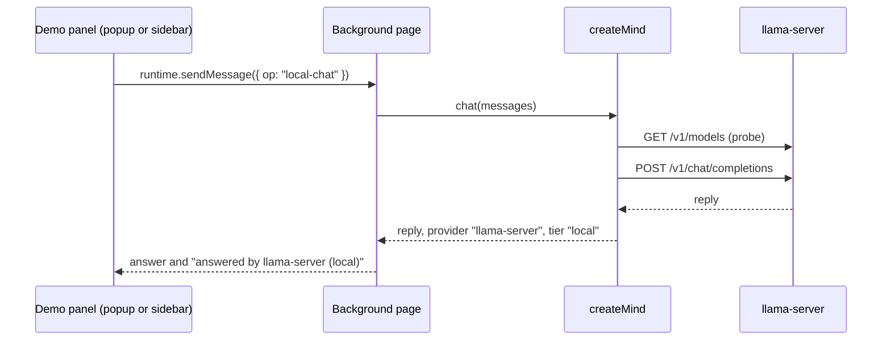
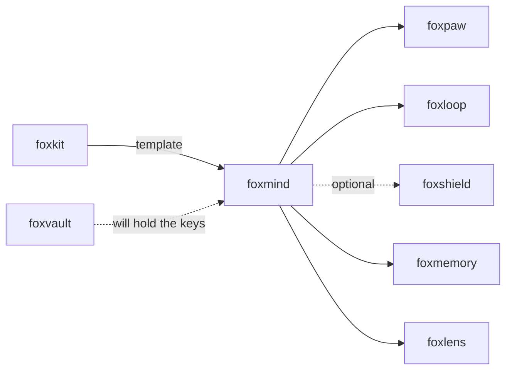

# foxmind

One API for on-device AI models in the browser and for your own model key.

foxmind gives you one `chat`, `embed`, `extract` and `classify` call over three
tiers of models: models that run in the browser, a model server on your own
machine, and a cloud model that you pay for with your own key. Every result
says which tier answered. When a tier cannot run, foxmind says why. It does not
switch to another tier in secret.

## Install

```bash
npm i foxmind
```

For the in-browser models, also install the optional peer dependency:
`npm i @huggingface/transformers`.

## Example

This runs in Node 24 or later. Start a local server first, for example
`ollama pull qwen3:0.6b`.

```js
import { createMind, ollama, saluki } from "foxmind";

const mind = createMind({
  providers: [saluki(), ollama({ model: "qwen3:0.6b" })],
  only: ["browser", "local"], // private mode: no cloud provider is ever called
});

const result = await mind.chat([{ role: "user", content: "Say hello in five words." }], { maxTokens: 1024 });
console.log(result.message.content);
console.log(`answered by ${result.provider} (${result.tier})`);
console.log(result.skipped.map((skip) => `${skip.provider}: ${skip.code}`));
```

Output on our test machine. Saluki was not running, so the router skipped it
and said why:

```text
Hi there!
answered by ollama (local)
[ 'saluki: unreachable' ]
```

Messages, tools and tool calls use the OpenAI chat completions shape. Code that
you wrote for that API works here.

## Use cases

| Who | What they build | How foxmind helps |
|---|---|---|
| A Firefox extension developer | Local AI features in an extension: search, summaries, form help | `foxmind/browser` runs embeddings and small chat models in the extension's background page, on WebGPU or on single-thread WASM. |
| A web app team | A "bring your own key" AI feature | `anthropic()` and `openaiCompatible()` take the user's key at call time and map both APIs to one shape. foxmind does not store the key. |
| An agent builder who wants privacy | A private-mode agent planner (for example in foxloop or foxmate) | `saluki()` runs Underdog Saluki 27B on llama-server on the same machine. `only: ["browser", "local"]` drops the cloud tier, so page text cannot leave the machine through foxmind. |
| A form-filling tool | Pull names, dates and places out of a request | `gliner2()` runs GLiNER2 entity extraction and label scoring in the browser, as foxpilot does. |
| A notes or bookmarks app | Local semantic search | `mind.embed()` with `transformers()` or Firefox's own `trialML()` gives vectors without a server. |
| A developer or a CI job | A check of which model servers run on a machine | `foxmind doctor` probes llama-server, Ollama and LM Studio, and prints the command that starts each one that is down. |

## How it works

```mermaid
flowchart TB
  caller["Your code: mind.chat / embed / extract / classify"] --> router["createMind router"]
  router -->|"1. drop tiers outside only, order by prefer"| order["providers in order"]
  order -->|"2. probe (cached 30 s)"| probe{"can it run now?"}
  probe -->|no| skip["add to result.skipped with code and reason"]
  skip --> order
  probe -->|yes| call["call the provider"]
  call -->|ok| result["result + provider + tier + skipped"]
  call -->|error| error["throw FoxmindError with code, provider, tier"]
  subgraph browser["Tier 1: in the browser"]
    T["transformers() embed or chat"]
    G["gliner2() extract and classify"]
    M["trialML() / wllama() on browser.trial.ml"]
  end
  subgraph local["Tier 2: a server on this machine"]
    L["llamaServer() / saluki() :8080"]
    O["ollama() :11434"]
    S["lmStudio() :1234"]
  end
  subgraph cloud["Tier 3: your own key"]
    A["anthropic()"]
    C["openaiCompatible({ baseURL, apiKey })"]
  end
  call --- browser
  call --- local
  call --- cloud
```

The router drops every provider whose tier is not in `only`, then tries the
rest in the `prefer` order. `prefer` only changes the order; use `only` when
text must not reach a tier. A provider that cannot run
now (no WebGPU, server down, model missing, permission not granted) is skipped,
and the skip goes into `result.skipped`. When a provider fails during a call,
the router throws that error. It tries the next provider only when you set
`fallbackOnError: true`, and never after text has streamed or the caller has
aborted.



In an extension, the models live in the background page (an event page with a
DOM in Firefox). Each view asks it with `runtime.sendMessage`, so the views
share one loaded model.

## API

### `foxmind` (Node and the browser)

| Export | What it does |
|---|---|
| `createMind({ providers, only?, prefer?, fallbackOnError?, probeTtlMs? })` | Makes the router. `only` is the list of tiers it may use (private mode: `["browser", "local"]`); it never probes or calls the others. `prefer` takes provider names or tiers and only changes the order. |
| `mind.chat(messages, { tools?, json?, onDelta?, temperature?, maxTokens?, timeoutMs?, signal? })` | Chat in the OpenAI shape. `onDelta` streams text. `json: true` fails with `bad_json` when the reply is not JSON. Tool call arguments are checked: they must be a JSON object. `timeoutMs` is the longest wait for the headers and then for each next piece of the body, so a slow stream that keeps sending is not cut. |
| `mind.embed(texts)` | One vector per text: `{ vectors, provider, tier, model, ms, skipped }`. |
| `mind.extract(text, labels, { threshold? })` | GLiNER2 entities per label: `{ entities: { label: [{ text, confidence, start, end }] } }`. |
| `mind.classify(texts, prompt, labels)` | GLiNER2 label scores per text: `{ scores: [{ label: probability }] }`. |
| `mind.status()` | Each provider's state (`idle`, `loading`, `ready`, `unavailable`, `error`), where it runs, download progress, and the last provider that answered. |
| `mind.probe()` / `mind.load(name)` | Probe every provider now. Download and start one model now. |
| `openaiCompatible({ baseURL, model, apiKey?, embedModel?, body?, checkModel?, timeoutMs? })` | Any OpenAI-compatible server: llama-server, Ollama, LM Studio, OpenAI, OpenRouter. The tier is `local` for localhost, else `cloud`. |
| `ollama({ model })`, `llamaServer()`, `lmStudio({ model })` | Presets with the usual local address and the start command in each failed probe. |
| `saluki({ thinking? })`, `SALUKI` | Underdog Saluki 27B on llama-server, the default planner for private mode. Thinking is off and temperature is 0 by default, the model card's settings for tool calls. |
| `anthropic({ apiKey, model?, maxTokens? })` | The Anthropic Messages API, mapped to the OpenAI shape. The default model is `claude-opus-5-5`. |
| `doctor(options)`, `formatDoctor(report)` | The `foxmind doctor` check as a function. |
| `FoxmindError` | Every failure. `code` is one of `no_provider`, `unreachable`, `timeout`, `aborted`, `rate_limited` (with `retryAfterMs`), `auth`, `model_not_found`, `http`, `stream_interrupted` (with `partial`), `bad_tool_call` (with `raw`), `bad_json`, `bad_response`, `unsupported`, `download_failed`, `cache_corrupt`, `out_of_memory`, `webgpu_missing`, `permission`. |

To run Saluki, follow its [model card](https://huggingface.co/ConwayResearch/Underdog-Saluki-27B-1.0):

```bash
huggingface-cli download ConwayResearch/Underdog-Saluki-27B-1.0 Underdog-Saluki-27B-1.0-IQ2-mix.gguf --local-dir .
llama-server -m Underdog-Saluki-27B-1.0-IQ2-mix.gguf --jinja -ngl 99 -fa on -c 32768
```

### `foxmind/browser` (extension pages and web pages)

| Export | What it does |
|---|---|
| `transformers({ task: "embed" \| "chat", model?, device?, dtype? })` | transformers.js. Defaults: `Xenova/all-MiniLM-L6-v2` for embed, `onnx-community/Qwen3-0.6B-ONNX` for chat. `device: "auto"` uses WebGPU when the browser has an adapter, else WASM, and `status().where` says which. |
| `gliner2({ model?, device?, dtype? })` | GLiNER2 extract and classify. Default model: `pooria/gliner2-multi-v1-agent-batch-ONNX` (614 MB at fp16). |
| `trialML({ task, model?, device? })`, `requestTrialML()` | Firefox's own engine, `browser.trial.ml`. Call `requestTrialML()` from a click to get the optional `trialML` permission. |
| `wllama({ model, modelFile, maxBytes? })` | Experimental. A GGUF model on Firefox's llama.cpp backend through trial ML. It refuses files over `maxBytes` (default 4 GB) before the download. |
| `configureRuntime({ wasmPaths?, remoteHost? })` | Where ONNX Runtime's WASM files are (default: `ort/` in the extension) and which model hub to use. |
| `hasWebGPU()`, `purgeModel(model)` | Detect a WebGPU adapter. Delete one model's files from Cache Storage. |

Each cached model file that does not load is deleted and downloaded once more,
and `status().reason` says so. A download that stops is not kept, so the next
call downloads again.

### CLI: `foxmind doctor`

```bash
npx foxmind doctor
```

```text
foxmind doctor · Node v25.9.0 · darwin arm64

local    ollama        yes  http://127.0.0.1:11434/v1    models: qwen3:0.6b
local    llama-server  yes  http://127.0.0.1:8080/v1     models: qwen3-0.6b.gguf
local    saluki        no   http://127.0.0.1:8080/v1     llama-server serves qwen3-0.6b.gguf, not Saluki. Download it with "huggingface-cli download ConwayResearch/Underdog-Saluki-27B-1.0 Underdog-Saluki-27B-1.0-IQ2-mix.gguf --local-dir .", then start it with "llama-server -m Underdog-Saluki-27B-1.0-IQ2-mix.gguf --jinja -ngl 99 -fa on -c 32768".
local    lm-studio     no   http://127.0.0.1:1234/v1     Cannot reach http://127.0.0.1:1234/v1/models: connect ECONNREFUSED 127.0.0.1:1234. Start it with "lms server start".
browser  WebGPU, trial.ml and in-browser models: doctor runs in Node and cannot check them. Load the demo extension in Firefox.
cloud    anthropic and cloud openaiCompatible: these need your own key. doctor does not read keys.
```

Flags: `--json`, `--ollama URL`, `--llama-server URL`, `--lm-studio URL`,
`--timeout MS`. The exit code is 0 when at least one server works, 1 when none
does, and 2 for bad input. There is no MCP server.

### Demo extension

`extension/` is a small Firefox extension. Its panel opens from the toolbar and
in the sidebar. It shows which tiers work, sends a test prompt to a local
server, and compares two sentences with an in-browser embedding model. Build it
with `pnpm build:ext` and load `dist-ext/manifest.json` from `about:debugging`.
To let it reach Ollama, start Ollama with `OLLAMA_ORIGINS="moz-extension://*"`.
Ollama refuses extension origins without it.

## Tests

`pnpm ci:local` runs lint, typecheck, 71 tests and the build. The tests start
fake servers and call them over real HTTP. `docs/failure-modes.md` lists each
failure mode (F1 to F72) and its test. The tests went in before the code.

`pnpm e2e` runs the real thing and writes `artifacts/e2e-<date>.json`. First it
sends chat, tool calls, streams and JSON requests to each local server that
runs. Then it starts Firefox with the demo extension. `FOXMIND_E2E_HEAVY=1`
adds Qwen3-0.6B chat and GLiNER2 in the browser. Results from our run on
2026-10-09, in `artifacts/e2e-2026-10-09.json` (Firefox 157.0.1, Apple M3 Pro,
headless, so WASM; all 32 checks passed):

| Check | Result |
|---|---|
| llama-server, Qwen3-0.6B GGUF: chat / tool call / stream | 82 ms / 632 ms / 210 ms |
| Ollama, qwen3:0.6b: chat / tool call / stream (it thinks first) | 1.7 s / 0.9 s / 1.3 s |
| MiniLM embedding in Firefox: first load with download / cached load / one call | 1,124 ms / 180 ms / 9 ms |
| Firefox trial ML, MiniLM embedding: first call / next call | 2.0 s / 17 ms |
| Qwen3-0.6B chat in Firefox (WASM, q4): first answer with download / tool call | 34.2 s / 28.3 s |
| GLiNER2 in Firefox (WASM, fp16): load with 614 MB download / extract / classify | 19.6 s / 1.6 s / 1.5 s |
| GLiNER2 against the Python gliner2 library | 14 of 14 reference cases match |
| Saluki 27B in the browser | refused before download: 7.90 GB is over the 4 GB limit |

## Firefox APIs used

| API | MDN | Why |
|---|---|---|
| `browser.trial.ml` (`createEngine`, `runEngine`, `onProgress`) | No MDN page: [Firefox source docs](https://firefox-source-docs.mozilla.org/toolkit/components/ml/extensions.html) | `trialML()` and `wllama()` run Firefox's own inference engine. |
| `permissions.request` / `permissions.contains` | [MDN](https://developer.mozilla.org/en-US/docs/Mozilla/Add-ons/WebExtensions/API/permissions/request) | Ask for the optional `trialML` permission, and check it before each call. |
| `optional_permissions` | [MDN](https://developer.mozilla.org/en-US/docs/Mozilla/Add-ons/WebExtensions/manifest.json/optional_permissions) | `trialML` is an optional-only permission. |
| `host_permissions` | [MDN](https://developer.mozilla.org/en-US/docs/Mozilla/Add-ons/WebExtensions/manifest.json/host_permissions) | The demo calls local servers on `127.0.0.1` and `localhost`. |
| `runtime.sendMessage` / `runtime.onMessage` | [MDN](https://developer.mozilla.org/en-US/docs/Mozilla/Add-ons/WebExtensions/API/runtime/sendMessage) | The panel asks the background page, which hosts the models. |
| `runtime.getURL` | [MDN](https://developer.mozilla.org/en-US/docs/Mozilla/Add-ons/WebExtensions/API/runtime/getURL) | ONNX Runtime loads its WASM files from inside the extension, because MV3 allows no remote code. |
| Background scripts (event page) | [MDN](https://developer.mozilla.org/en-US/docs/Mozilla/Add-ons/WebExtensions/Background_scripts) | The page that hosts the models. It has a DOM, Cache Storage and WebGPU. |
| `action` popup and `sidebar_action` | [MDN](https://developer.mozilla.org/en-US/docs/Mozilla/Add-ons/WebExtensions/manifest.json/sidebar_action) | The demo panel opens in both places. |
| `content_security_policy` with `'wasm-unsafe-eval'` | [MDN](https://developer.mozilla.org/en-US/docs/Mozilla/Add-ons/WebExtensions/manifest.json/content_security_policy) | Lets the extension compile WebAssembly. |
| `unlimitedStorage` | [MDN](https://developer.mozilla.org/en-US/docs/Mozilla/Add-ons/WebExtensions/manifest.json/permissions#unlimitedstorage) | Model files can be hundreds of MB. |
| `browser_specific_settings.gecko.data_collection_permissions` | [MDN](https://developer.mozilla.org/en-US/docs/Mozilla/Add-ons/WebExtensions/manifest.json/browser_specific_settings) | The demo collects no data. If your extension sends page text to a cloud key, declare `websiteContent` under `optional`. |
| WebGPU (`navigator.gpu.requestAdapter`) | [MDN](https://developer.mozilla.org/en-US/docs/Web/API/GPU/requestAdapter) | `device: "auto"` picks WebGPU only when there is an adapter. |
| WebAssembly | [MDN](https://developer.mozilla.org/en-US/docs/WebAssembly) | ONNX Runtime runs models on the CPU when there is no WebGPU. |
| `crossOriginIsolated` / `SharedArrayBuffer` | [MDN](https://developer.mozilla.org/en-US/docs/Web/API/Window/crossOriginIsolated) | Extension pages have no `SharedArrayBuffer`, so the runtime uses one WASM thread. |
| Cache Storage (`caches`) | [MDN](https://developer.mozilla.org/en-US/docs/Web/API/CacheStorage) | transformers.js caches model files there. foxmind deletes a model's files when they do not load. |
| `fetch`, `AbortSignal.timeout`, `AbortSignal.any` | [MDN](https://developer.mozilla.org/en-US/docs/Web/API/AbortSignal/any_static) | Every server call has a timeout and honors the caller's abort. |

## Limits

- We did not run Saluki 27B. We tested the `saluki()` preset against a fake
  server and checked that it refuses to run in the browser. The Saluki
  benchmark numbers are from its vendor (Underdog Bench, 120 tasks), not from
  us.
- A 27B model in the browser is not proven. `wllama()` refuses GGUF files over
  4 GB, and trial ML takes models only from the Mozilla and Xenova orgs.
- `wllama()` is experimental. In our Firefox 157 runs, the llama.cpp engine
  started but never answered, so the call ends with code `timeout`.
- We tested `anthropic()` and cloud `openaiCompatible()` against fake servers
  only. No real API key was used.
- Small in-browser chat models are slow on WASM (about 28 s per answer for
  Qwen3-0.6B), and they call a tool only when the prompt asks for it.
- We ran GLiNER2 on WASM only. Its WebGPU read-back code comes from foxpilot
  and has no foxmind test yet.
- For a model as small as MiniLM, WebGPU was not faster than WASM in our
  headed run.
- `json: true` on Anthropic is a system-prompt rule plus a JSON check, not
  constrained decoding.
- foxmind does not retry. On `rate_limited`, use `retryAfterMs` to decide.
- Firefox unloads an idle background page, and the loaded model goes with it.
  An open popup or sidebar keeps the page loaded.
- Firefox allows one trial ML engine per extension.
- The in-browser providers do not run in Node. The server and cloud tiers do.
- ONNX Runtime adds about 27 MB of WASM to an extension.

## Part of the fox primitives



foxmind depends on no other fox primitive. The GLiNER2 code comes from
[foxpilot](https://github.com/pooriaarab/foxpilot) (MIT, same author).

## License

[MIT](LICENSE)
